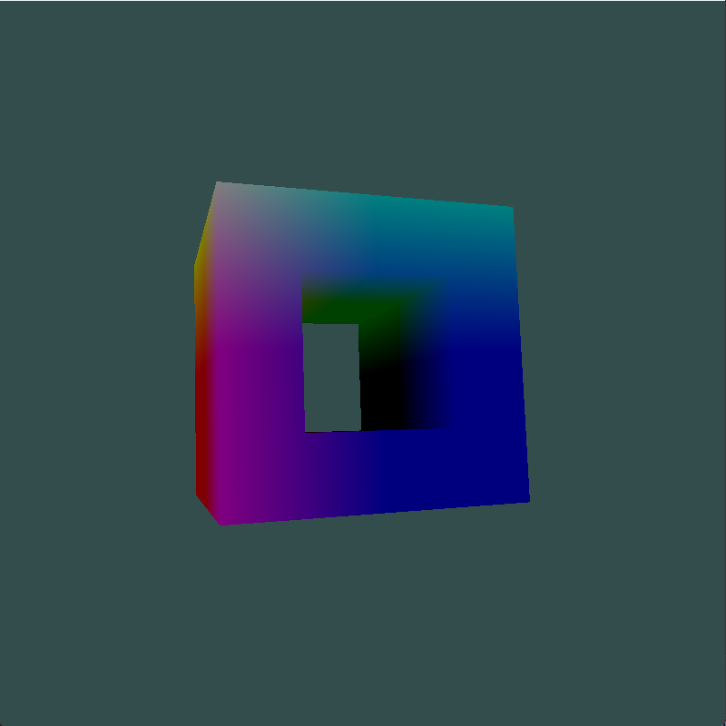

该仓库为三维CAD大作业建立，主要内容是：
1. 定义半边数据结构
2. 实现5个欧拉操作
3. 实现扫掠操作

### 项目结构
> 
.  
├── Dependencies  项目依赖
│   ├── GLEW      OpenGL扩展库
│   ├── GLFW      图形库  
│   └── eigen-3.4.0     矩阵库  
├── shader
│   ├── fragment.shader 片段着色器  
│   ├── vertex.shader  顶点着色器  
│   └── vertexWithoutColor.shader  顶点着色器  
├── src  项目主要代码文件夹  
│   ├── Camera  摄像机类（暂未使用）  
│   │   ├── Camera.cpp  
│   │   └── Camera.h  
│   ├── CameraPOV.h 第一人称摄像机类  
│   ├── Shader.cpp  着色器封装  
│   ├── Shader.h  着色器封装头文件  
│   ├── main.cpp  程序入口  
│   ├── model  模型定义  
│   │   ├── Edge.h  边与半边  
│   │   ├── EulerOperation.h  欧拉操作  
│   │   ├── Face.h  面  
│   │   ├── Loop.h  环  
│   │   ├── Point.h  点（几何）  
│   │   ├── Solid.h  实体  
│   │   └── Vertex.h   点（拓扑）  
│   ├── stb_image.cpp  图片读取  
│   ├── stb_image.h  图片读取  
│   ├── test  测试  
│   │   └── EulerOperationTest.h  测试代码  
│   └── visual  可视化  
│       ├── earcut.h  ear-clipping实现    
│       └── testVisual.h  测试可视化  

使用按键0, 1, 2分别进入3个测试案例，测试0和测试2显示一个正方体，测试1显示一个带孔的正方体（如下图），窗口中使用 `W`, `S`, `A`, `D`， 以及鼠标操作摄像机位置和视角。

>
1. 项目中包含3个不同分支，ear-clipping分支以及glut分支是两种不同的可视化方法，暂时并未更新glut可视化。
2. sweep只支持与坐标轴平行的方向的扫掠（因为我在使用ear-clipping三角剖分时，需要将三维点投影到二维平面，而我选择了坐标面）
